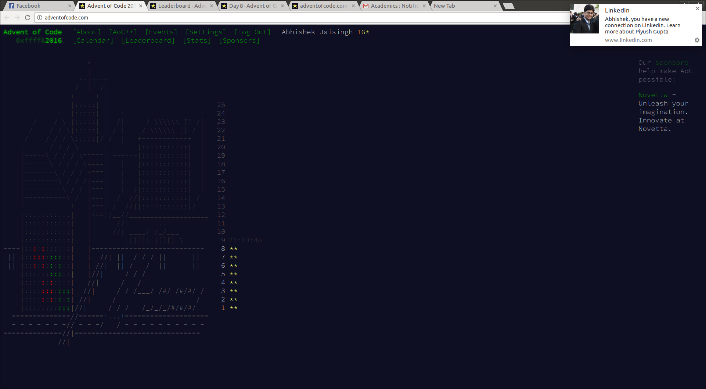

# Advent of Code Solutions

[My](https://github.com/abhishekjiitr/) solutions to the programming puzzles on [Advent of Code](http://adventofcode.com/).

Solutions are written mostly in CPP and Python.

### What is Advent of Code?

_"Advent of Code is a series of small programming puzzles for a variety of skill levels. They are self-contained and are just as appropriate for an expert who wants to stay sharp as they are for a beginner who is just learning to code. Each puzzle calls upon different skills and has two parts that build on a theme."_

## Screenshot
 

### License

GNU